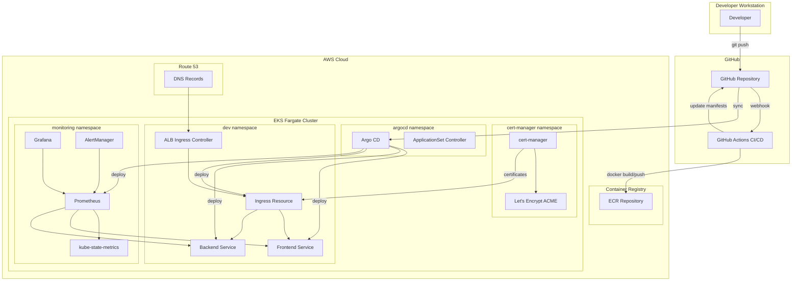

# K8s Advanced WebApp Architecture

## Overview

This document describes the architecture of a cloud-native web application deployed on AWS EKS Fargate with GitOps practices, observability, and cost optimization.

## High-Level Architecture Diagram



## Component Descriptions

### Infrastructure Layer

**AWS EKS Fargate**

- Serverless Kubernetes cluster eliminating node management overhead
- Auto-scaling based on pod requirements
- Enhanced security with pod-level isolation
- Cost-effective for variable workloads

**Namespaces**

- `dev`: Application workloads (frontend, backend)
- `monitoring`: Observability stack (Prometheus, Grafana)
- `cert-manager`: TLS certificate management
- `argocd`: GitOps continuous deployment

### Application Layer

**Frontend Service**

- React Single Page Application (SPA)
- Served via nginx container
- Health checks on `/health` endpoint
- Resource limits: 256Mi memory, 0.25 vCPU

**Backend Service**

- FastAPI Python application
- RESTful API with OpenAPI documentation
- Database connectivity (future enhancement)
- Resource limits: 512Mi memory, 0.5 vCPU

### Networking & Security

**ALB Ingress Controller**

- AWS Application Load Balancer integration
- Path-based routing to services
- SSL/TLS termination at load balancer
- Health check configuration

**cert-manager**

- Automated TLS certificate provisioning
- Let's Encrypt ACME integration
- Certificate renewal automation
- Wildcard certificate support

### Observability Stack

**Prometheus**

- Metrics collection from all services
- Service discovery via Kubernetes API
- Long-term storage via Persistent Volumes
- Custom recording rules for efficiency

**Grafana**

- Visualization dashboards
- Pre-configured dashboards for Kubernetes metrics
- Alert visualization
- User authentication integration

**kube-state-metrics**

- Kubernetes object state metrics
- Resource usage tracking
- Deployment status monitoring

**AlertManager**

- Alert routing and grouping
- Notification channels (email, Slack)
- Alert silencing and inhibition

## GitOps Flow

### Continuous Deployment Pipeline

1. **Developer Workflow**

   - Developer commits code to feature branch
   - Pull request triggers CI pipeline
   - Code quality checks and tests run

2. **Build Phase**

   - GitHub Actions builds Docker images
   - Images tagged with git SHA
   - Push to Amazon ECR repository

3. **Manifest Update**

   - CI updates Kubernetes manifests with new image tags
   - Changes committed to GitOps repository
   - Helm chart versions bumped

4. **Argo CD Sync**

   - Argo CD detects repository changes
   - Compares desired vs actual state
   - Applies changes to cluster

5. **Rollout Strategy**
   - Progressive rollout with health checks
   - Automatic rollback on failures
   - Notification on deployment status

### App-of-Apps Pattern

```yaml
# Root Application managing child applications
apiVersion: argoproj.io/v1alpha1
kind: Application
metadata:
  name: root-app
spec:
  source:
    repoURL: https://github.com/org/k8s-advanced-webapp
    path: gitops/
  destination:
    server: https://kubernetes.default.svc
  syncPolicy:
    automated:
      prune: true
      selfHeal: true
```

## Cost Control Strategies

### Fargate Right-Sizing

- Start with minimal resource requests
- Monitor actual usage via Prometheus
- Adjust limits based on p95 metrics
- Use Horizontal Pod Autoscaler (HPA)

### Resource Quotas

```yaml
# Namespace resource limits
apiVersion: v1
kind: ResourceQuota
metadata:
  name: dev-quota
spec:
  hard:
    requests.cpu: "4"
    requests.memory: "8Gi"
    persistentvolumeclaims: "2"
```

### Cost Optimization Best Practices

1. **Spot Instances for Non-Critical Workloads**

   - Development environments
   - Batch processing jobs
   - CI/CD runners

2. **Scheduled Scaling**

   - Scale down dev environments after hours
   - Weekend resource reduction
   - Holiday mode configurations

3. **Monitoring & Alerts**

   - Cost anomaly detection
   - Resource waste identification
   - Unused resource cleanup

4. **Storage Optimization**
   - Use GP3 volumes for better cost/performance
   - Implement retention policies
   - Archive old logs to S3

### Estimated Monthly Costs (US-East-1)

- EKS Control Plane: ~$72
- Fargate Compute (dev workload): ~$50-100
- ALB: ~$25
- Data Transfer: ~$10-20
- Monitoring Storage: ~$10-20
- **Total**: ~$200-300/month for basic setup

## Security Considerations

### Network Policies

- Default deny all traffic
- Explicit allow rules per service
- Egress restrictions

### Pod Security Standards

- Non-root containers
- Read-only root filesystem
- No privileged escalation

### Secrets Management

- External Secrets Operator (future)
- AWS Secrets Manager integration
- Encrypted at rest

## Disaster Recovery

### Backup Strategy

- Persistent volume snapshots
- Application state in git
- Database backups to S3

### Multi-Region Considerations

- Route 53 health checks
- Cross-region replication
- Failover procedures
